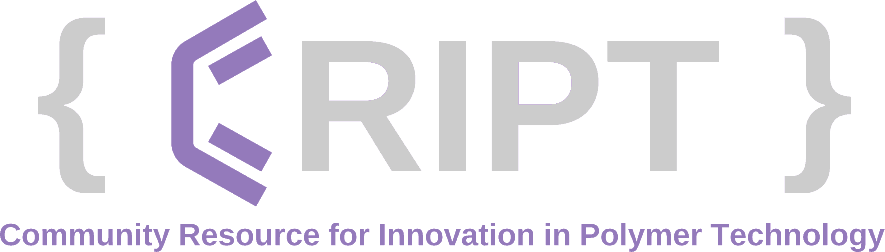

# CRIPT Python SDK

[](https://github.com/C-Accel-CRIPT/Python-SDK/blob/develop/LICENSE.md)

[](https://github.com/C-Accel-CRIPT/Python-SDK/blob/develop/LICENSE.md)
[](https://www.python.org/)
[](https://github.com/psf/black)
[](https://criptapp.org/)
[](https://docs.pytest.org/en/7.2.x/)
[](https://python-JSONSchema.readthedocs.io/en/stable/)
[](https://requests.readthedocs.io/en/latest/)
[](https://squidfunk.github.io/mkdocs-material/)

[](https://github.com/C-Accel-CRIPT/Python-SDK/actions/workflows/trunk.yml)
[](https://github.com/C-Accel-CRIPT/Python-SDK/actions/workflows/tests.yml)
[](https://github.com/C-Accel-CRIPT/Python-SDK/actions/workflows/codeql.yml)
[](https://github.com/C-Accel-CRIPT/Python-SDK/actions/workflows/mypy_check.yaml)

<!-- [](https://github.com/C-Accel-CRIPT/Python-SDK/actions/workflows/dependency-review.yml) -->

<!-- just shows pass/fail instead of percentage
[](https://github.com/C-Accel-CRIPT/Python-SDK/actions/workflows/test_coverage.yaml)
-->

## CRIPT Availability

Currently, CRIPT is only available for users in the USA, and it is equipped with geo-blocking functionality that restricts access for users outside the USA. We are diligently working towards making CRIPT accessible worldwide. We appreciate your patience as we strive to achieve this goal!

---

## What is it?

The CRIPT Python SDK allows programmatic access to the [CRIPT platform](https://criptapp.org). It can help automate uploading your data to CRIPT, and aims to allow for manipulation of your CRIPT data through the python language. This is a perfect tool for users who have python experience and have large amount of data to upload to [CRIPT](https://criptapp.org).

---

## Installation

CRIPT Python SDK requires Python 3.10+

The latest released of CRIPT Python SDK is available on [Python Package Index (PyPI)](https://pypi.org/project/cript/)

```bash
pip install cript
```

---

## Documentation

To learn more about the CRIPT Python SDK please check the [CRIPT Python SDK user documentation](https://c-accel-cript.github.io/Python-SDK/)

To learn more about the internal workings of the CRIPT Python SDK please check the [CRIPT Python SDK internal documentation](https://github.com/C-Accel-CRIPT/Python-SDK/wiki)

---

## Release Notes

Please visit the [GitHub Releases page](https://github.com/C-Accel-CRIPT/Python-SDK/releases/latest) for a detailed release notes.

---

## We Invite Contribution

To get started, feel free to take a look at our [Contribution Guidelines](CONTRIBUTING.md) for
a detailed guide on how to contribute to our repository and become a part of our community.

Whether you want to report a bug, propose a new feature, or submit a pull request, your contribution is highly valued.

For development documentation to better understand the Python SDK code please visit the
[Python SDK Wiki](https://github.com/C-Accel-CRIPT/Python-SDK/wiki).
If you encounter any issues please let us know via
[issues section](https://github.com/C-Accel-CRIPT/Python-SDK/issues) or
[discussion sections](https://github.com/C-Accel-CRIPT/Python-SDK/discussions).

To learn more about our great community and all the open source plugins made by our fantastic community available
for the [CRIPT Python SDK](https://github.com/C-Accel-CRIPT/Python-SDK) please take a look at the
[plugins section](https://github.com/C-Accel-CRIPT/Python-SDK/discussions/categories/plugins).

We appreciate your interest in contributing to our project! Together, let's make it even better! 🚀

Happy coding!
