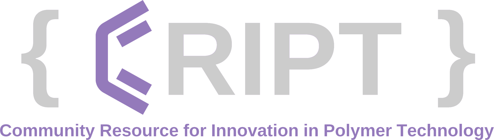

**CRIPT** (the _Community Resource for Innovation in Polymer Technology_) is a web-based platform for capturing and sharing polymer data. In addition to a user interface, CRIPT enables programmatic access to the platform through the CRIPT Python SDK, which interfaces with a REST API.

CRIPT offers multiple options to upload data, and scientists can pick the method that best suits them. Using the SDK to upload is a great choice if you have a large amount of data, stored it in an unconventional way, and know some python programming. You can easily use a library such as [Pandas](https://pandas.pydata.org/) or [Numpy](https://numpy.org/) to parse your data, create the needed CRIPT objects/nodes and upload them into CRIPT.

Another great option can be the [Excel Uploader](https://c-accel-cript.github.io/cript-excel-uploader/) for scientists that do not have past Python experience or would rather easily input their data into the CRIPT Excel Template.

## Disclaimer

!!! Warning "CRIPT Availability"
    Currently, CRIPT is only available for users in the USA, and it is equipped with geo-blocking functionality that restricts access for users outside the USA.

    > We are diligently working towards making CRIPT accessible globally. We appreciate your patience as we strive to achieve this goal!

---

## Resources

??? info "CRIPT Resources"

    - [CRIPT Data Model](https://chemrxiv.org/engage/api-gateway/chemrxiv/assets/orp/resource/item/6322994103e27d9176d5b10c/original/main-supporting-information.pdf)
        - The CRIPT Data Model is the back bone of the whole CRIPT project. Understanding it will make it a lot easier to use any part of the system
    - [CRIPT Scripts Research paper](https://pubs.acs.org/doi/10.1021/acscentsci.3c00011)
        - Learn about the CRIPT platform
    - [CRIPTScripts](https://criptscripts.org/)
        - CRIPT Scripts is a curated list of examples and tools for interacting with the CRIPT platform.
    - [CRIPT Python SDK Internal Documentation](https://github.com/C-Accel-CRIPT/Python-SDK/wiki)
        - Learn more about the internal workings of the CRIPT Python SDK
    - [CRIPT Python SDK Discussions Tab](https://github.com/C-Accel-CRIPT/Python-SDK/discussions)
        - Communicate with the CRIPT Python SDK team
    - [CRIPT Python SDK Contributing Guidelines](https://github.com/C-Accel-CRIPT/Python-SDK/blob/develop/CONTRIBUTING.md)
        - Learn how to contribute to the CRIPT Python SDK open-source project
    - [CRIPT Python SDK Contributors](https://github.com/C-Accel-CRIPT/Python-SDK/blob/develop/CONTRIBUTORS.md)
